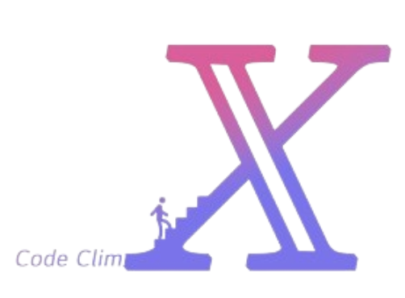

  

<h1 align="middle">CodeClimX</h1>
<h3 align="middle">명강의 학습을 위한 AI 기반의 학습 어플리케이션</h3>

🔎 프론트 서버 레포지토리 : 
https://github.com/babyybiss/CodeClimX

 

# 📝 작품소개

AI를 활용하여 개발 관련 해외 대학 강의에 한글 자막을 단 동영상을 제공하여,
강의 내용 기반 RAG 챗봇, 강의 내용 기반 생성형 AI퀴즈, 그리고 커뮤니티를 제공하는 모바일 어플리케이션입니다.
 영어권 나라에서 주도적으로 신기술이 빠르게 나오는 가운데 더욱 빠르게 따라잡기 위해 
유익한 영상들을 한글로 번역하여 해당 기술 또는 새롭게 변화되는 IT필드의 변화들에 대한 정보를 전달하고자 합니다.
  
공신력 있는 기관 또는 공식 문서로 굉장히 많은 자료들이 나와있는데 
YOUTUBE 라는 대형 플랫폼에서는 빠르게 변해가는 IT 직군의 트렌드, AI 신기술,
또는 컴퓨터 사이언스에 대한 기본 지식 등등에 대한 유명 대학의 명강의 자료들이 굉장히 많습니다.

하지만 모두 영어로 출시 되는 부분이 많다보니 많은 개발자분들께서는 공감이 되시겠지만 영어가 익숙치 않은 분들께서는 어쩔 수 없이 번역을 하거나 자막 생성을 해서 봐야합니다.
  안타깝게도, 유투브에서 제공 되는 실시간 자막 생성 기능에는 "자막 사용 불가" 라던가 "어...음..." 이러한 필링러들이 필터링 되지 않아 자막을 보며 강의를 시청하는 입장에서는 가독성이 떨어지며 불편하다는 문제점을 해결하고자합니다.
  일반적으로 웹 기반인 학습 플랫폼과는 달리 저희는 영상 기반의 학습이다보니 언제 어디서나 사용이 가능하도록 플러터로 하이브리드 어플리케이션을 개발하여 제공 되는 명강의들은 한글로 잘 번역하여 영상을 제공하고 영상 시청에서 끝!이 아니라 명강의 학습까지 도울 수 있는 RAG 기반 챗봇, 퀴즈, 커뮤니티와 같은 세부적인 기능들까지 개발하였습니다.

 

# 🌁 사용 기술
Flutter를 기반으로 한 프론트엔드 어플리케이션과 Python을 사용하는 백엔드 시스템을 통합한 구조입니다.
백엔드에서는 FastAPI를 통한 통신과 PyTorch 및 OpenAI를 활용한 AI 모델 배포를 지원합니다.
또한, 음성 인식(STT) 및 자연어 처리 기능에는 Splade와 SentenceTransformers와 같은 임베딩 모델을 사용하여 고도화된 처리 능력을 제공합니다.

 

# 🎞 Demo
https://github.com/babyybiss/CodeClimX_chatBot/assets/131161981/bf9f9596-d2a6-47c8-ab7d-dc98ed7c1d9a

 

# ⭐ 주요 기능
## 강의 내용 번역 : 번역 적용 된 강의 영상 제공, 영상 내용 기반 검색

 
 

## RAG 챗봇 : 강의 내용 중 모르는 건 RAG 기반 챗봇에게 질문 

  

## 퀴즈 : 주관식, 객관식, 피드백

  

## 커뮤니티 : 강의 내용 외의 질문 AI 자동 답변, 사용자 커뮤니티 형성

 

# 🔨 프로젝트 구조

 

# 🔧 Stack

**Frontend(Ios, Android)**
- **Language** : Dart
- **Library & Framework** : Flutter
 

**Backend**
- **Language** : Python
- **Library & Framework** : FastAPI, PyTorch, SBERT.net & Sentence Transformers, Huggingface, Langchain, Pinecone
- **Database** : Firebase(Storage)

 

